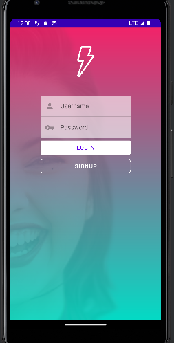
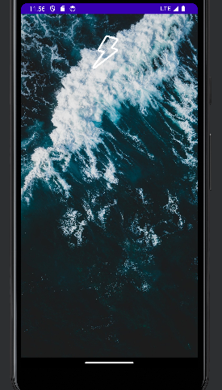
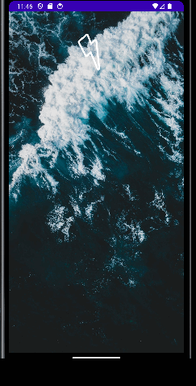
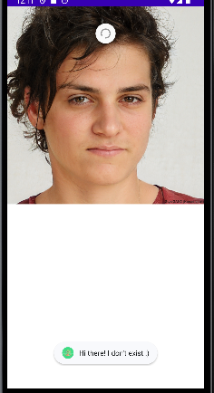
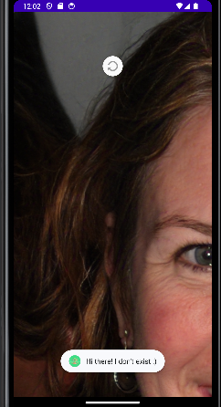

## Aqui se muestra la primera pantalla de **mi aplicacíon**

## Cambiamos el login añadiendo una capa de desefoque encima.
## Clicando el boton de login, nos lleva a una pagina que de momento esta en blanco.
## Clicando en el boton singup, nos lleva a una pagina que es una replica de la pagina inicial "login".

## Cree un splash para sustituir a la animación inicial default de Android.

## tambien una pagina NoPeople que al hacer SwipeRequest, cambia la imagen que te muestra.

## También hice un pull request al proyecto de Rodrigo Álvarez.